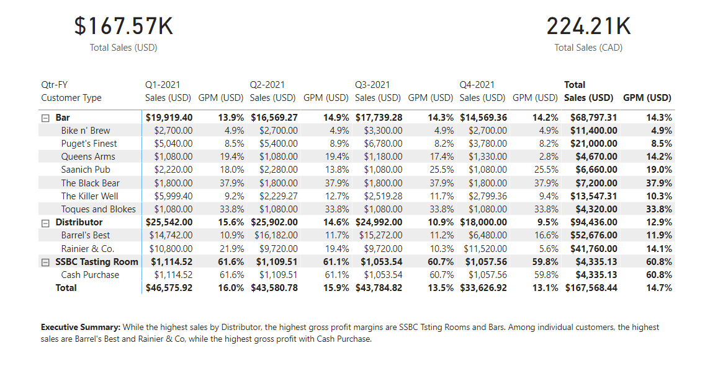
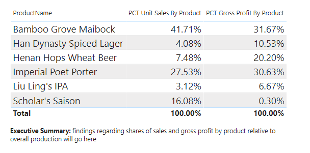

# Seven-Sages-Brewing-Company
Prepare and Model Data in Power bi - This project is part of Udacity Nanodegree (<a href="https://www.udacity.com/course/data-analysis-and-visualization-with-power-BI-nanodegree--nd331" target="_blank">Data Analysis Visualization in Power bi</a>)

## Data Source
All the data sources are separate related files in different formats. You can find all the files used in this project in the "source files" folder.

## ETL
Loaded all the source files into Power bi to clean them up.
#### Initial Cleanup
<ul>
  <li>Promoted first rows to headers as needed</li>
  <li>Reviewd data types for each field</li>
  <li>Renamed any ambigous queries and columns</li>
</ul>

#### Combining Data
<ul>
  <li>Merged dimnesions tables with 1-to1 relationship (CFO Metrics Tracker and SSBC Product Offerings) to create the Products table.</li>
  <li>Sales information are in a mulitple files in the "Monthly Sales Logs" folder. Since share the same column name, I appended all files a created one Sales table</li>
</ul>

#### More Cleanup
<ul>
  <li>Removed any and all blank rows</li>
  <li>Deleted unnecessary columns</li>
  <li>Corrected any obvious typos that will imapct the final report</li>
</ul>

## Date table Creation
I created a dynamic date table that automatically updates to fit new data and to avoid future errors and headaches. The data is continues that covers each full calendar year in the sales data set (starting on January 1st and ending on December 31st. In addition, the table includes the following:

<ul>
  <li>Calendar month name and number</li>
  <li>Calendar year</li>
  <li>Fiscal period</li>
  <li>Fiscal year</li>
  <li>Fiscal quarter -Quarter - FY (e.g., Q1 - FY2021)</li>
</ul>

## Data Model
The data model consits of one fact table and four dimension tables
<b>Fact table</b>: sales
<b>Dimension tables</b>: Products, Customers, Date, USD-CAD Exchange Rates

## Measures
1- Total Sales
2- Cost of Sales
3- Gross Profit Margin
4- Sales in CAD
5- Unit sales by Product (%)
6- Gross Product by Product (%)

### Report
#### Report #1: summarize sales by customer and customer type across quarters

#### Report #2:  summarize the percentages of gross profit and unit sales by product.

